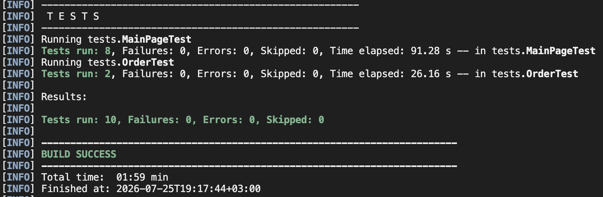

# Яндекс.Самокат — UI-автотесты

UI-автотесты для учебного сервиса «Яндекс.Самокат» (https://qa-scooter.education-services.ru/).

Покрыты два сценария:
- раскрытие ответов в блоке «Вопросы о важном»;
- позитивный сценарий заказа самоката — с двух точек входа (кнопки «Заказать» вверху и внизу страницы) на двух наборах данных.

## Инструменты

- Java 11
- Maven
- JUnit 5 (Jupiter) + параметризованные тесты
- Selenium WebDriver 4.27
- JavaFaker — генерация данных покупателя
- Google Chrome и Mozilla Firefox (драйверы подтягивает встроенный Selenium Manager)
- Паттерн Page Object

## Структура проекта

```
Sprint_6/
├── pom.xml                                    # Maven-конфигурация, зависимости
├── readme.md
├── docs/                                      # скриншоты прогонов
└── src/
    └── test/
        └── java/
            ├── pageobjects/                   # Page Object: локаторы и действия страниц
            │   ├── MainPage.java              # главная (куки, кнопки «Заказать», «Вопросы о важном»)
            │   ├── OrderFirstStepPage.java    # форма заказа, шаг «Для кого самокат»
            │   ├── OrderSecondStepPage.java   # форма заказа, шаг «Про аренду»
            │   └── OrderConfirmationPage.java # поп-апы «Хотите оформить заказ?» и «Заказ оформлен»
            └── tests/                         # тесты, сгруппированы по функциональности
                ├── BaseTest.java              # запуск и закрытие браузера, адрес стенда
                ├── MainPageTest.java          # блок «Вопросы о важном»
                └── OrderTest.java             # позитивный сценарий заказа
```

## Запуск

```
mvn test                    # Chrome (по умолчанию)
mvn test -Dbrowser=firefox  # Firefox
```

Браузер выбирается системным свойством `-Dbrowser` (`chrome` | `firefox`); по умолчанию — `chrome`.

## Результаты

В Firefox все тесты проходят (MainPageTest 8/8, OrderTest 2/2):



## Известный баг

В Chrome не удаётся оформить заказ: после подтверждения не появляется окно «Заказ оформлен». Баг воспроизводится только в Chrome. Поэтому `OrderTest` в Chrome падает — тест нашёл дефект; в Firefox тот же тест проходит.

## Нестабильность кликов по блоку «Вопросы о важном»

Изредка `MainPageTest` падает с такой ошибкой:

```
ElementClickInterceptedException: Element <div id="accordion__heading-5" class="accordion__button">
is not clickable at point (966,462) because another element  obscures it
```

Причина на стороне приложения. Декоративная картинка самоката лежит в контейнере `div.Home_Scooter__3YdJy` с `position: fixed`, а её вертикальное смещение пересчитывает обработчик прокрутки — на кадр позже самой прокрутки. В этот момент картинка ещё висит поверх блока с вопросами, и клик по заголовку перехватывается. Замеры сразу после прокрутки и через 100 мс:

```
IMMEDIATE  covered=true   topEl=/assets/scooter.png   scooterTop=94
  +100ms   covered=false  topEl=DIV.accordion__button scooterTop=-1369
```

Под картинкой в первый момент оказываются все заголовки, поэтому падение плавающее: успел клик до перерисовки — тест зелёный, не успел — падает. `ExpectedConditions.elementToBeClickable` здесь не помогает: оно проверяет только видимость и доступность элемента, но не то, что элемент находится сверху и по нему реально можно попасть курсором.

Лечится повтором клика через `WebDriverWait.ignoring(ElementClickInterceptedException.class)`; в текущей версии тестов не реализовано.
